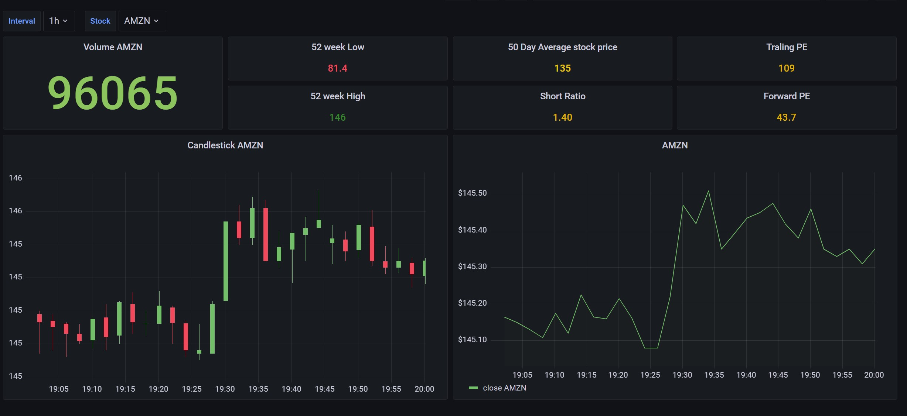

---

# Real-Time Stock Data Streaming and Analysis

## Overview

This project is designed to retrieve real-time stock data, perform streaming data analysis using Apache Kafka and Apache Spark, store data in InfluxDB, and visualize the data with Grafana. It aims to provide insights into the stock market and allow users to monitor stock prices effectively.  General information regarding the stock is also retrieved and stored onto a Postrgesql database.

## Table of Contents

- [Prerequisites](#prerequisites)
- [Getting Started](#getting-started)
- [Project Structure](#project-structure)
- [Project Components](#project-components)
- [Data Flow](#data-flow)
- [Dashboard Preview](#dashboard-preview)
- [Configuration](#configuration)
- [Contributing](#contributing)

## Prerequisites

Before you begin, ensure you have met the following requirements:

- Docker and Docker Compose installed
- Python 3.8 or higher
- Kafka, Spark, InfluxDB, and Grafana images available in your Docker environment
- Stock symbols and necessary API keys if applicable

## Getting Started

To get started with this project, follow these steps:

1. Clone the repository to your local machine:

   ```bash
   git clone [https://github.com/JawaharRamis/stock-price-analysis-kafka-spark-influxdb-grafana.git]
   ```

2. Change to the project directory:

   ```bash
   cd real-time-stock-analysis
   ```

3. Run the Docker Compose file to set up the project environment:

   ```bash
   docker-compose up -d
   ```

4. Access the different services:

   - Apache Kafka: http://localhost:9092
   - Apache Spark: http://localhost:8080
   - InfluxDB: http://localhost:8086
   - Grafana: http://localhost:3000

## Project Structure

The project structure is organized as follows:

```
├── producer/              # Python scripts to produce stock data
├── consumer/              # Spark Streaming consumer
├── logs/                  # Log files generated by the application
├── docker-compose.yml     # Docker Compose configuration file
├── .env                   # Environment variables for the project
├── README.md              # Project documentation (this file)
```
Certainly! Here's a section in your `readme.md` that outlines the components of your project:

---

## Project Components

The real-time stock data streaming project comprises several key components, each with its unique role and functionality. Understanding these components is essential to grasp the architecture and operation of the project. Here are the primary components:

### 1. Kafka

**Description**: Apache Kafka is an open-source stream-processing platform that serves as the central data streaming backbone for the project.

**Role**: Kafka acts as a distributed message broker, receiving real-time stock data from producers and making it available to consumers. It enables scalable, fault-tolerant data streaming.

### 2. Producers

**Description**: The producers are responsible for fetching real-time stock data from various sources and publishing it to Kafka topics.

**Role**: Producers here include scripts that retrieve stock information from `yfinance` library and sending this data to Kafka topic and/or databases. They format the data and send it to Kafka for distribution.

### 3. Kafka Consumers

**Description**: Kafka consumers are applications that subscribe to Kafka topics and process the incoming stock data.

**Role**:  Spark Streaming component which acts as the consumer process real-time stock data as it arrives from Kafka, perform transformations, and send the data to InfluxDB for storage.

### 4. InfluxDB

**Description**: InfluxDB is a high-performance, open-source time-series database designed for storing and querying large volumes of time-series data.

**Role**: InfluxDB serves as the primary data store for the project. It stores the transformed real-time stock data, making it available for analysis, visualization, and reporting.

### 5. Grafana

**Description**: Grafana is an open-source analytics and monitoring platform that enables the creation of interactive dashboards and alerts.

**Role**: Grafana is used to visualize and monitor real-time stock data stored in InfluxDB. It provides a user-friendly interface for creating and customizing dashboards and visualizations.

### 7. PostgreSQL

**Description**: PostgreSQL is a powerful open-source relational database management system.

**Role**: PostgreSQL may be used for storing general stock information that does not require real-time updates. It provides a structured storage solution for static stock data.

---

## Data Flow

1. Real-time stock data is retrieved using the producer scripts and sent to Kafka topics.

2. The Spark Streaming consumer reads data from Kafka topics and stores the results in InfluxDB. Before sending real-time stock data to InfluxDB, it is essential to transform the data into a compatible format known as InfluxDB Point. InfluxDB Points are the fundamental unit of data in InfluxDB and consist of the following components:
   - **Measurement**: The measurement name represents the specific dataset or data stream being collected. In our case, the measurement name is typically set to `"stock-price-v1"`.

   - **Tags**: Tags are key-value pairs that provide metadata or labels for the data. For example, a stock symbol like `"AMZN"` can be a tag, allowing you to filter and group data based on the stock       symbol.

   - **Fields**: Fields represent the actual data values associated with the measurement. These are typically numeric values such as stock prices, volumes, or other metrics.

   - **Timestamp**: Each InfluxDB Point has a timestamp, indicating when the data was recorded.

3. Grafana is used to visualize and monitor the stock data stored in InfluxDB.

## Dashboard Preview

The real-time stock monitoring dashboard provides a comprehensive view of stock prices and key metrics. Below is a preview of the dashboard:



This dashboard allows you to track stock prices, analyze trends, and make informed decisions. Explore historical data, monitor real-time updates, and gain valuable insights into the stock market.


## Configuration

- Configuration for various services, such as Kafka, Spark, InfluxDB, and Grafana, can be found in the `docker-compose.yml` file.

- Environment variables can be configured in the `.env` file.

## Contributing

Contributions to this project are welcome! To contribute:

1. Fork the repository.
2. Create a new branch for your feature or bug fix.
3. Make your changes and submit a pull request.


